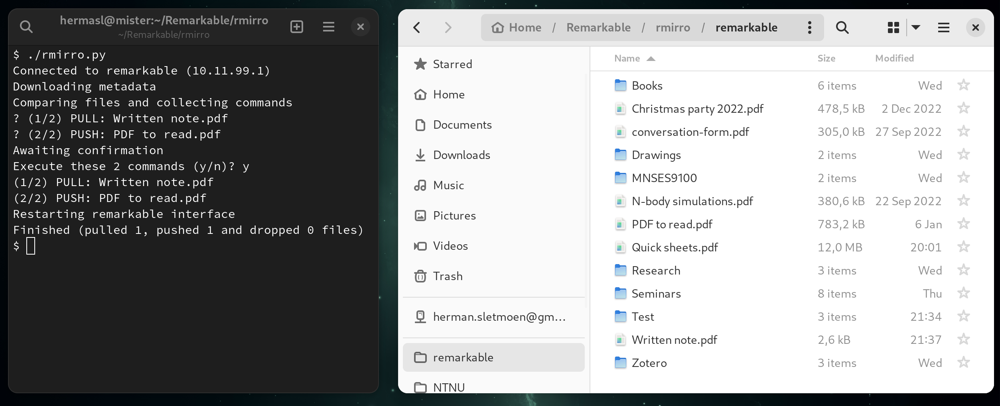

# rmirro

`rmirro.py` is a Python script that maintains a live mirror image
of your reMarkable's files in a folder on your computer that directly matches its file structure.
Documents on the reMarkable are downloaded as PDFs to this folder,
and documents put in the folder are uploaded to the reMarkable.

"rmirro" is what you get by shifting the characters in "mirror" cyclically one step to the right.

## Requirements
`rmirro.py` reads your reMarkable's file structure and downloads and uploads files to it over SSH and USB.
* The reMarkable must be connected to your computer with a USB cable.
* The reMarkable's [USB web interface](https://remarkablewiki.com/tech/webinterface) must be enabled.
* The reMarkable must be accessible through [passwordless SSH login](https://remarkablewiki.com/tech/ssh#passwordless_login_with_ssh_keys) (by running e.g. `ssh remarkable`).

## Operation
`rmirro.py` creates a folder on your computer, by default named `remarkable/`, from which you can read and upload documents to your reMarkable.
Documents and folders that have been added, modified or removed on the reMarkable or computer since the last run are transferred to or removed from the other device.
More specifically, the program traverses files and folders on both the reMarkable (RM) and the computer (PC), and takes the following actions depending on where they are present and when they were last modified:

|                  | 🟢 **On PC**                                  | 🔴 **Not on PC** |
|------------------|-----------------------------------------------|------------------|
| 🟢 **On RM**     | Download/upload if newer on RM/PC             | Download         |
| 🔴 **Not on RM** | Upload/remove if added after/before last sync |                  |

Note the "asymmetry" of the two cells where the file is only on one device:
files are removed from PC if they are deleted from RM (this is the interpretation of "remove if added before last sync"),
but files are not deleted from RM if they are deleted on PC, to prevent accidental file loss.
However, files on RM can be *overwritten* by files uploaded from PC!

## Auto-synchronise when connecting USB cable

Run `rm_sync_on_connect_setup.sh` to install an [udev](https://en.wikipedia.org/wiki/Udev) rule on your system (requires root access)
that automatically runs `rmirro.py` when the reMarkable is connected to your computer.

## Motivation (and opinions)

I created this script because
* I want my reMarkable *integrated with my computer's native file system*, **not** available only through some cloud solution or additional program.
* I want to read my reMarkable files as *PDFs* in whichever PDF viewer *I prefer*, **not** through some special viewer in a cloud solution or special program, or after rendering them with third-party program.
* I want to upload (multiple) PDFs to my reMarkable by dropping them in a folder on my computer, **not** by uploading them (one by one) through a web interface or special program.
* I want to retrieve annotated PDFs by opening the same file on my computer that I used to upload them in the first place.

## Disclaimer

The program prompts the user for confirmation before proceeding and executing operations.
**However, it can potentially overwrite or delete files on your computer or reMarkable.**
I do not guarantee that it works as expected, so back up your data and use it at your own risk!
